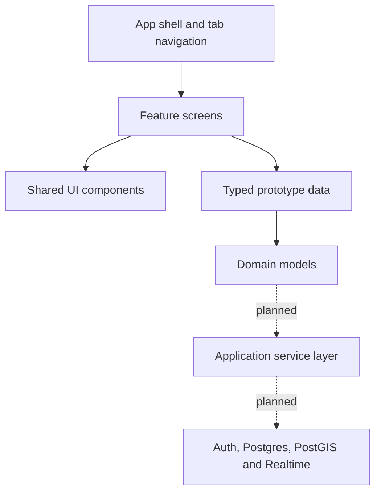

# King of the Court

An interactive mobile prototype for organizing local pickup basketball, building squads, finding nearby opponents, and competing for court-specific rankings.

> **Project status:** Portfolio-ready front-end prototype. The interface and core user journeys are interactive; authentication, live location, matchmaking, and ratings currently use representative mock data rather than a production backend.

## The idea

Pickup basketball is easy to want and surprisingly difficult to coordinate. Players need enough people, a suitable court, a fair matchup, and confidence that everyone will actually appear.

King of the Court brings those decisions into one experience:

- Find nearby 1v1 and team games
- Create squads for 2v2 through 5v5 basketball
- Invite friends and compare player ratings
- See activity at nearby courts
- Follow court-specific top-player leaderboards
- Challenge the reigning King of a court in a verified 1v1

## Prototype walkthrough

The current build includes five primary areas:

| Area | What can be explored |
| --- | --- |
| Home | Player overview, nearby activity, upcoming games, and quick actions |
| Play | 1v1/team filters, ranked and casual games, and match requests |
| Courts | Nearby-court activity, court details, rankings, and King challenges |
| Squad | 2v2–5v5 roster selection, invitations, and opponent search |
| Profile | Overall rating, attributes, progression, record, and friends |

## Technology

- Expo SDK 57
- React Native
- TypeScript
- Reusable UI components and design tokens
- Typed player, game, squad, and court domain models
- Isolated mock-data layer designed to be replaced by an API

## Architecture



The prototype deliberately separates presentation components from domain types and seed data. This keeps the interface fast to iterate while preserving a clear path to persistent accounts, realtime presence, and geographic queries.

## Run locally

Install the dependencies:

```bash
pnpm install
```

Start the Expo development server:

```bash
pnpm start
```

On macOS, the iOS Simulator can be opened with:

```bash
NODE_OPTIONS=--dns-result-order=ipv4first pnpm exec expo start --localhost --clear
```

Press `i` after Metro starts. Android can be opened from Expo by pressing `a` when an emulator is available.

## Product decisions

- Player location should be represented as an explicit, expiring court check-in—not a continuously visible coordinate.
- Competitive results require confirmation from both sides or a trusted scorekeeper.
- Ratings are calculated by the server and explained through an auditable match history.
- The King title changes hands only through a declared, verified crown challenge.
- Repeat-opponent limits and provisional ratings reduce farming and early rating volatility.

## Current scope and next milestones

### Implemented

- Interactive account entry
- Five-section mobile navigation
- Game discovery and filtering
- Join and challenge feedback
- Squad-size and friend-invite interactions
- Court activity and leaderboard detail views
- Player card, attributes, and progression UI

### Next

- Persistent prototype state and complete create-game/result flows
- Account authentication and profile management
- Friend requests and squad membership
- PostGIS-powered nearby-court discovery
- Realtime, privacy-conscious court check-ins
- Verified results and server-owned rating calculations
- Reporting, blocking, moderation, and notifications
- Automated component, integration, and end-to-end tests

## Documentation

- [Product blueprint](docs/PRODUCT_BLUEPRINT.md)
- [Portfolio case study](docs/PORTFOLIO_CASE_STUDY.md)
- [Demo recording guide](docs/DEMO_SCRIPT.md)
- [LinkedIn launch kit](docs/LINKEDIN_LAUNCH_KIT.md)

## Verification

```bash
pnpm run typecheck
```

The TypeScript project passes strict type-checking, and the JavaScript application bundle has been validated for iOS.
